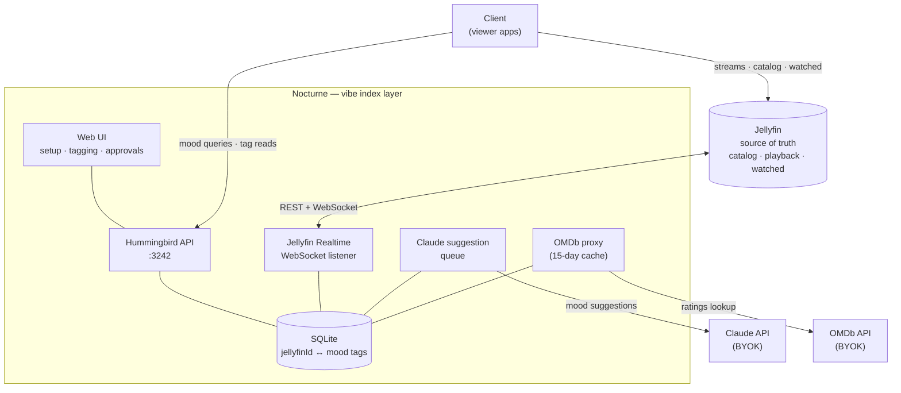

# Nocturne

> [!NOTE]
**Answer "What should I watch tonight?" based on how you feel, not just by genre.**
>
> Imagine having 500+ movies in Jellyfin and spending 30 minutes every night scrolling through them. Genre filters didn't help because "Thriller" includes everything from *The Bourne Identity* to *Hereditary*.
>
> I wanted to browse by *mood*, not just category. So I built this.

Nocturne is a vibe-based movie discovery layer that sits alongside Jellyfin, organizing your library by each film's atmosphere and tone instead of generic genres. It powers a dedicated viewer app and includes a web UI for setup and tag management.

---

## Why Nocturne?

**The Problem:** Browsing by genre doesn't match how you actually choose movies. "Action" doesn't tell you if it's a brainless popcorn flick or a slow-burn thriller.

**The Solution:** Movie's mood-based organization. Instead of "Thriller," you browse:
- 🎭 **Dialogue-Driven** - Character-focused narratives
- 🌧️ **Rain & Neon Aesthetic** - Cyberpunk/neo-noir vibes  
- 🧠 **Brainmelt Zone** - Mind-bending psychological films
- 😂 **Ha Ha Ha** - Pure comedy, no drama

**36 curated moods** (expandable) that actually answer "what matches my vibe right now?"

---

## Architecture



> [!Important]
> Jellyfin is the source of truth. Nocturne is a pure vibe-index layer — it stores only
> `jellyfinId → mood tags` and never mirrors Jellyfin metadata. Clients talk to
> Jellyfin directly for catalog/playback and to Nocturne for mood curation.

**How it works:**
1. Nocturne syncs your Jellyfin library by ID only (one-time setup via Web UI, then real-time WebSocket reconciliation)
2. New movies auto-queue a Claude mood-tag suggestion (hybrid approval flow)
3. Admin reviews suggestions in the Web UI and approves/rejects before tags are written
4. Clients join their Jellyfin data with Nocturne's mood tags on the fly

---

## Features

### Core
- ✅ **Mood-based organization** — 36 curated moods (see full list below)
- ✅ **Real-time sync** — Jellyfin WebSocket listener keeps the ID set fresh
- ✅ **Hybrid auto-tagging** — Claude queues mood suggestions, admin approves
- ✅ **Manual tagging** — Web UI for fine-tuning
- ✅ **Import/Export** — Backup your mood mappings
- ✅ **External ratings** — OMDb proxy for IMDb/RT/Metacritic (BYOK, shared 15-day cache)
- ✅ **Built-in Web UI** — No separate admin tools needed
- ✅ **Slim by design** — stores only Jellyfin IDs + tags; no mirrored metadata

### Privacy
- 🔒 **Local-first** - All data in `./data/nocturne.sqlite`
- 🔒 **No telemetry** - Zero tracking, no accounts
- 🔒 **BYOK only** - AI tagging requires your own API key (optional)

---

## Quick Start

### Option 1: Docker (Recommended)
```bash
docker run -d --name nocturne-server -p 3242:3242 \
  -v "$(pwd)/data:/app/data" \
  -v "$(pwd)/config:/app/config" \
  -v "$(pwd)/logs:/app/logs" \
  -e WEBUI_PORT=3242 \
  -e NOCTURNE_DATABASE_PATH=/app/data/nocturne.sqlite \
  --restart unless-stopped \
  ghcr.io/imgkl/nocturneserver:latest
```

Then:
1. Open `http://localhost:3242` in your browser (Web UI)
2. Complete setup wizard (enter Jellyfin URL + credentials)
3. Run initial sync

### Option 2: Local Development
```bash
git clone https://github.com/imgkl/NocturneServer
cd NocturneServer
./run.sh
```

Web UI: `http://localhost:8001`

---
## Mood Buckets (36 Total)

<details>
<summary>Click to expand full mood list</summary>

### Character & Dialogue
- Dialogue-Driven
- Vibe Is the Plot
- Existential Core
- Antihero Study
- Ensemble Mosaic

### Crime & Noir
- Crime, Grit & Style
- Men With Vibes (and Guns)
- Obsidian Noir
- Rain & Neon Aesthetic
- Cat and Mouse

### Psychological
- Brainmelt Zone
- The Twist Is the Plot
- Psychological Pressure-Cooker
- Late-Night Mind Rattle
- Uncanny Vibes

### Atmosphere
- Slow Burn, Sharp Blade
- One-Room Pressure Cooker
- Visual Worship
- Rainy Day Rewinds
- Quiet Epics

### Emotional
- Emotional Gut Punch
- Feel-Good Romance
- Coming of Age
- Bittersweet Aftermath

### Genre-Specific
- Ha Ha Ha (Comedy)
- Horror & Unease
- Heist Energy
- Time Twists

### Curated Collections
- Film School Shelf
- Modern Masterpieces
- Regional Gems
- Underseen Treasures
- Based on Vibes (True Story)
- Cult Chaos
- Experimental Cinema
- WTF Did I Watch

</details>

---

## Web UI Features

Access at `http://your-server:3242`

- **Setup Wizard** - Initial Jellyfin connection configuration
- **Sync Management** - Manual sync, view sync status and history
- **Movie Browser** - View all movies with their current mood tags
- **Tag Editor** - Add/remove mood tags from individual movies
- **AI Auto-Tag** - Bulk suggestions for untagged movies (requires Claude API key)
- **Import/Export** - Backup and restore your mood mappings
- **Settings** - Configure integrations (OMDB, Claude API)

---
## Roadmap

- [x] Jellyfin integration
- [x] Mood tagging system
- [x] Real-time webhook sync
- [x] Web UI for admin tasks
- [x] AI auto-tagging (BYOK: Claude)
- [x] Import/Export mood mappings
- [x] OMDB ratings integration (BYOK)
- [ ] User-defined custom moods
- [ ] Multi-user support
- [ ] Advanced filtering (combine moods, exclude tags)
- [ ] Mood analytics (most-watched moods, etc.)

---

## Contributing

This is a personal project, but PRs are welcome for:
- Bug fixes
- New mood definitions (with clear criteria)
- Performance improvements
- Web UI enhancements

Please open an issue first to discuss major changes.

---

## License

MIT - Use it, fork it, modify it. Just don't blame me if your movie night goes wrong.

---

## Credits

Built to solve a personal problem: "I have 500 movies but can't decide what to watch."

Inspired by the realization that mood > genre for actually picking movies.
